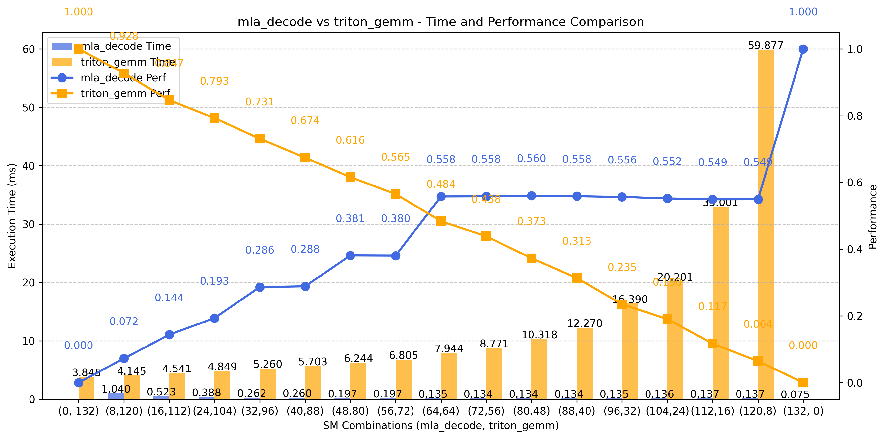
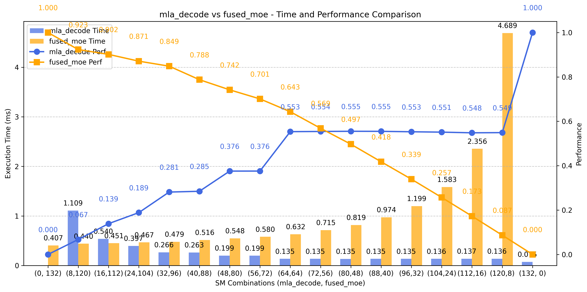
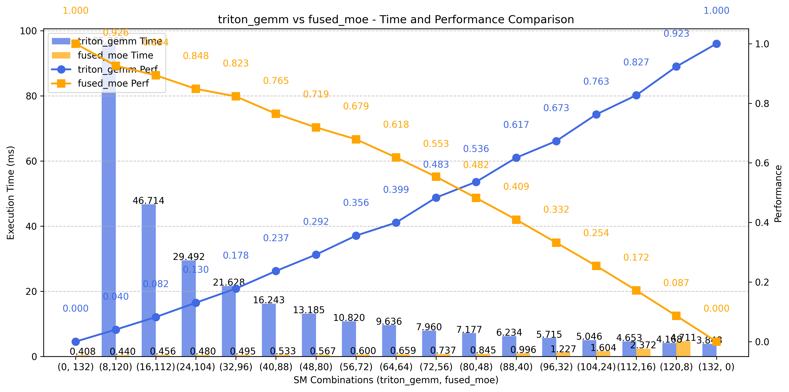

# Cuda Kernel Interference Performance

This repository provides a standardized framework for CUDA kernel performance testing and execution management.

## Core Components

### KernelBase Class

Base class exposing the following key methods for standardized kernel testing workflows:

- get_param_list(): Retrieves configurable kernel parameters
- set_params(): Applies runtime parameters
- prepare_input(): Handles input data preparation
- launch_kernel(): Executes the CUDA kernel
- profile_kernel_us(): Measures kernel execution time (μs)
- get_best_performance_us(): Returns optimal performance metrics

### Resource Management

Built-in interfaces for:

- CUDA stream management
- SM (Streaming Multiprocessor) allocation
- Enables performance testing under varying compute resource constraints.

## Implementation Guide

To integrate a new operator:

- Inherit from KernelBase
- Implement all required methods
- Refer to the reference implementation: [mla/kernel_mla_decode.py](mla/kernel_mla_decode.py)

## Single kernel test

```shell
cd green_ctx_test
python3 mla_decode.py
```

## Interference test

```shell
cd green_ctx_test/interference
# if meet errors about cuda sync, try CUDA_LAUNCH_BLOCKING=1
python3 ./interference_test.py
```



