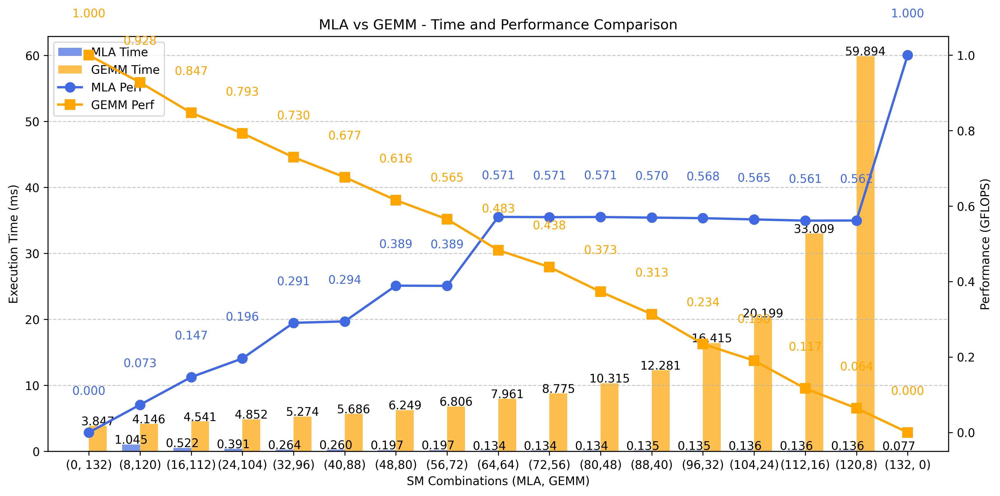

# Readme About Cuda Kernel Interference Performance

## Tree
```shell
./code_test/
├── allreduce
│   ├── test_allreduce.py      # 单测all reduce，代码修改自vllm
│   └── test_ray.py            # 单测ray
├── fp8_gemm
│   ├── test_deep_gemm.py      # 单测deep_gemm，代码修改自vllm，运行可能有问题
│   └── test_fp8_gemm.py       # 单测triton gemm，代码修改自vllm
├── green_context
│   └── green_context.py       # 测试的基础，提供stream控制接口
├── green_ctx_test
│   ├── attn_prefill.py        # green ctx测试Attn Prefill
│   ├── fused_moe.py
│   ├── gemm.py                # green ctx测试triton matmul
│   ├── green_ctx_test_fp8.py  # green ctx测试deep gemm，需要放在DeepGEMM/tests目录下使用
│   ├── green_ctx_triton.py    # 遗留物，green ctx测试triton vector add
│   ├── interference
│   │   ├── gemm_and_mladecode.py # 测试gemm和mla decode并行运行的干扰，功能已合入interference_test.py
│   │   ├── interference_test.py  # 通用测试脚本，支持连续测试任意多对算子
│   │   └── mla_gemm.png       # 参考结果示例
│   ├── mla_decode.py          # green ctx测试MLA Decode
│   └── test_utils.py          # 测试辅助函数
├── mla
│   ├── flash_attn_interface.py # vllm attn的接口，这个文件在github上没有，site-package里有。放在这里只是方便看内容
│   ├── test_flash_attn.py     # 测试fa prefill，不确定可信度，代码来自vllm
│   └── test_mla_decode.py     # 单测MLA Decode，代码修改自vllm
├── moe
│   ├── test_block_fp8.py      # 测试fused moe，代码来自vllm
│   └── utils.py               # 辅助函数
├── README.md
└── triton_example
    └── triton_kernel.py       # 遗留物，triton vector add
```

## Example

```shell
cd green_ctx_test/interference
python3 ./interference_test.py
```

